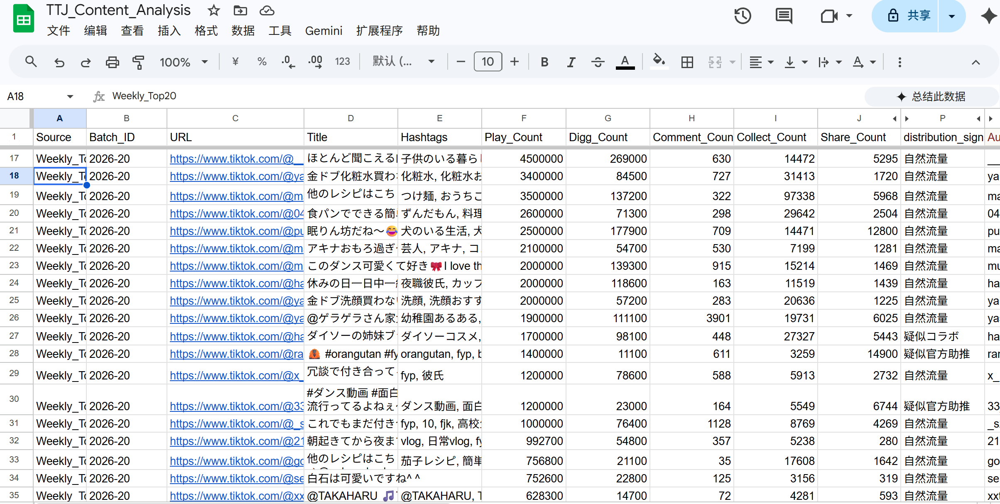
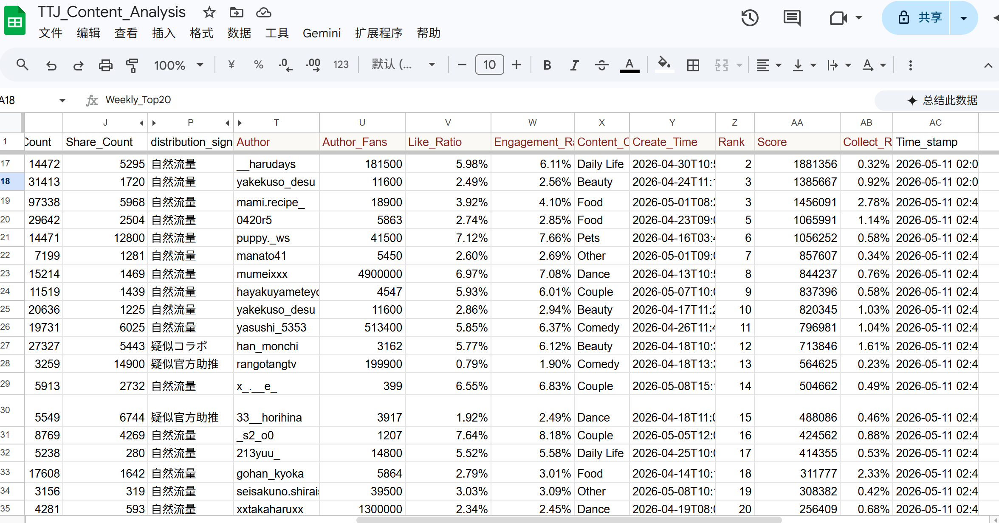
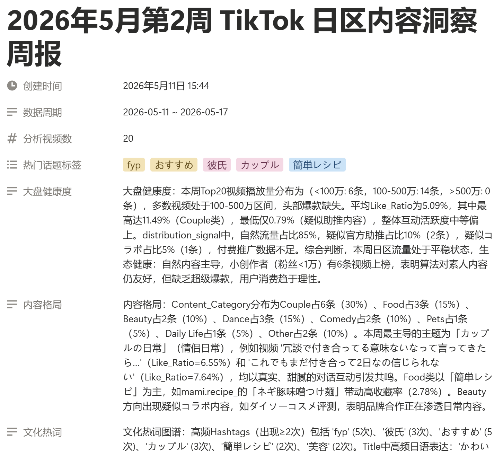
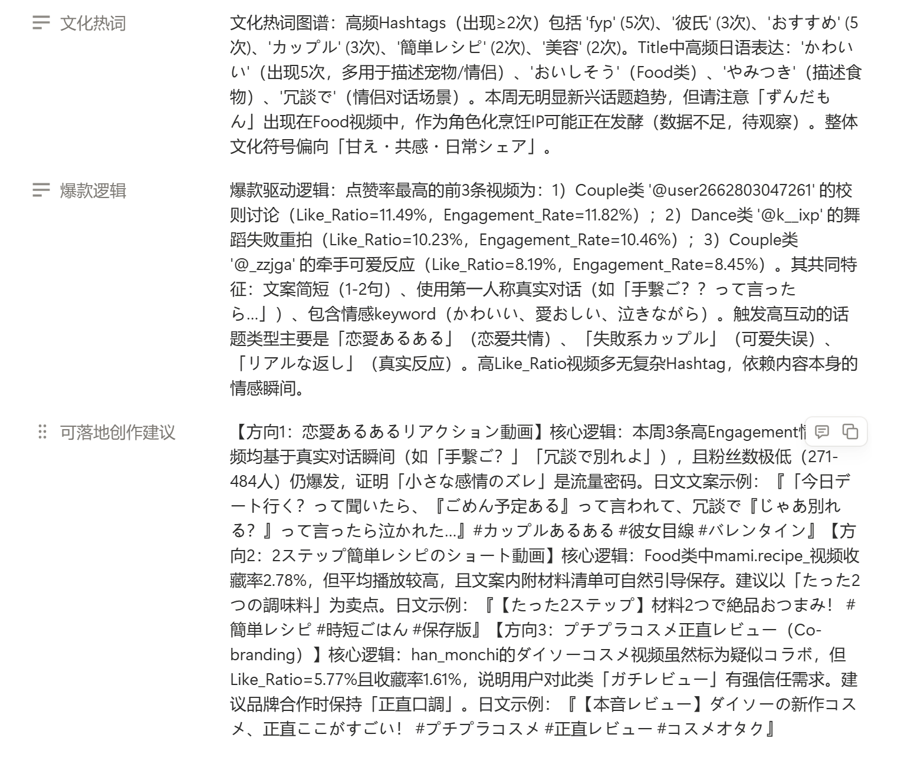

[中文](README.md) | **English**

# TT-Insight — TikTok Japan Content Intelligence System

Automatically scrapes trending TikTok videos in Japan, calculates engagement metrics, classifies content, generates structured AI weekly reports, and archives them to Notion.

## Architecture

```
n8n (Docker, localhost:5678)
  ├─ Apify clockworks~tiktok-scraper  → Batch scrape Japan hashtag + search videos
  ├─ Google Sheets                     → Structured data storage (29 columns)
  ├─ DeepSeek API                      → AI weekly report generation (hallucination-free)
  └─ Notion                            → Report archiving and display
```

## Features

### Stage 1: Manual Single-Video Analysis
Submit a TikTok video URL → AI deep analysis (copy breakdown, audience profile, business insights) → Results written to Google Sheets and displayed back.

### Stage 2: Weekly Auto Top-Video Analysis + AI Report
One-click trigger → Batch scrape videos from 10 Japan trending hashtags + 3 search keywords → Deduplicate / filter / sort by engagement → Take Top N → Calculate metrics per video and store to Sheets → AI generates structured weekly report (market health, content landscape, viral logic, cultural keywords, creator tips, ad ecosystem) → Write to Notion.

### Stage 3 (Planned): Natural Language–Driven Agent Analysis
User asks an open-ended question (e.g. *"What's the hottest direction in TikTok Japan gaming videos right now?"* or *"Which content trends are best for brand campaigns?"*) → Agent autonomously deconstructs intent and decides scraping strategy → Dynamically selects hashtags/keywords to scrape → AI performs direct semantic understanding of video content (replacing current keyword-rule classification) → Outputs a custom report answering the original question.

**Stage 3 will not depend on n8n.** The plan is to build with Claude API + Tool Use + GitHub Actions, enabling the Agent to make true context-driven decisions rather than executing a fixed pipeline.

---

## Output Samples

### Google Sheets Data Storage

Raw video data (play count, engagement counts, hashtags) and calculated metrics (Like_Ratio, Engagement_Rate, Content_Category, distribution_signal, etc.) are written to a single sheet — 29 columns total.


*Columns A–T: source, URL, title, hashtags, engagement counts, distribution signal*


*Columns U–AC: author info, Like_Ratio, Engagement_Rate, content category, rank, score*

### AI Weekly Report (Notion Archive)

After each weekly analysis, DeepSeek generates a structured report that is automatically written to Notion, covering market health, content landscape, cultural keywords, viral logic, and actionable creator tips.


*Report header: metadata, trending hashtags, market health, content landscape, cultural keywords*


*Report lower half: cultural keywords (cont.), viral logic analysis, actionable creator tips*

### Weekly Report Text Samples

The report supports bilingual output — core analysis in Chinese, trending hashtags and cultural keywords preserved in Japanese.

- [Chinese version sample](docs/samples/weekly_report_zh.txt)
- [Japanese version sample (日本語版)](docs/samples/weekly_report_ja.txt)

---

## Quick Start

```bash
# 1. Start n8n
docker-compose up -d

# 2. Open n8n
# http://localhost:5678

# 3. Stage 1: Left menu → Forms → Submit a video URL
# 4. Stage 2: Open the workflow → Click "Execute workflow"
```

## Project Structure

```
TT-insight/
├── build_workflow.js        # Workflow build script (core — defines all nodes and connections)
├── deploy.js                # Reads build output → PUT deploys to n8n API
├── docker-compose.yml       # n8n Docker config
├── .env.example             # Environment variable template
├── backups/                 # Workflow version backups
│   ├── workflow_before_hashtag_strategy.json   # Build base (28 nodes)
│   └── workflow_hashtag_strategy_new.json      # Latest build output (29 nodes)
├── CLAUDE.md                # AI assistant handbook (n8n API, node notes, gotchas)
└── CHANGELOG.md             # Historical fixes and architecture decisions
```

---

## Technical Decisions & Limitations

### Decision Log

| Decision | Choice | Rationale |
|----------|--------|-----------|
| Data source | Hashtag + search approximation of trending | TikTok has no public organic trending API for Japan; Creative Center data is ad-only |
| Single-video analysis (weekly path) | Code node deterministic metrics | AI cannot see video footage; hook/audience fields are pure hallucination. Code cuts cost 90%, speeds up 10× |
| Weekly report prompt | Pre-built in Code node | n8n AI Agent's `text` field does not evaluate `={{ }}` expressions — must embed real data via `JSON.stringify` in a Code node, otherwise AI only receives a literal string |
| Report metadata | Post-processing override in clean-up Code node | AI-generated dates/counts are unreliable; n8n runtime variables are used to force-overwrite for accuracy |
| Content classification | Keyword rule matching (12 categories) | Per-item AI classification is expensive at batch scale; rules are accurate for known categories but miss emerging ones |

### Known Limitations

- **Fixed pipeline, no dynamic decisions**: Hashtag list is hardcoded; no context-aware adaptation of search strategy
- **Content understanding limited to text**: The scraper only returns title and hashtags — neither AI nor rules can access video footage, audio, or subtitles
- **n8n expression evaluation gap**: AI Agent `text` field does not evaluate expressions, requiring an extra Code node as an intermediary layer
- **Fan-out execution model**: n8n triggers a node once per incoming item — N videos trigger N Sheets reads, generating unnecessary API calls
- **Logic embedded in strings**: Code node JavaScript lives as strings inside JSON, with no IDE support, no unit testing, and unreadable diffs

### Architectural Evolution (Stage 3)

The current n8n approach is well-suited for rapid prototyping, but the same requirements would be implemented fundamentally differently under an Agent paradigm:

```
User question: "What's the hottest direction in TikTok Japan gaming videos?"
     ↓
Claude Agent (intent understanding)
     ↓ tool calls
  ├─ search_tiktok(hashtags=[...])    # dynamically decided search strategy
  ├─ analyze_video(title, tags)       # AI semantic understanding, no rules
  ├─ sheets_write(results)            # direct API operations
  └─ generate_answer(question, data)  # custom answer to the original question
     ↓
Direct answer to the user's question
```

**Stack shift**: Claude API + Tool Use → replaces n8n AI Agent nodes; GitHub Actions → replaces n8n scheduled triggers; TypeScript/Python functions → replaces Code node strings. No n8n framework dependency — all logic lives in code, fully testable and version-controlled.

---

## Dependencies

- [Docker](https://www.docker.com/)
- [n8n](https://n8n.io/) (running via Docker)
- [Apify](https://apify.com/) account + API Token
- [DeepSeek](https://platform.deepseek.com/) API Key
- Google Sheets API credentials (configured inside n8n)
- Notion Integration Token (configured inside n8n)
